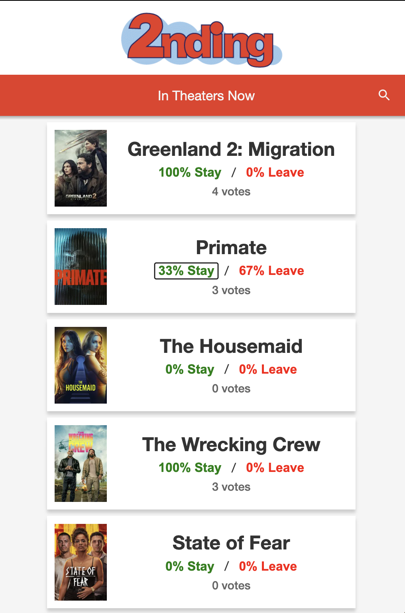

# ss15-static-like-wool-fabric

This is an app created over the weekend for the following competition

http://www.staticshowdown.com/

## Tech stack

- [Polymer 0.5](https://github.com/Polymer/polymer/tree/v0.5.6) Web Components (custom elements + HTML Imports)
- [Core Elements](https://github.com/Polymer/core-elements/tree/v0.5.6) and [Paper Elements](https://github.com/Polymer/paper-elements/tree/v0.5.6)
- Grunt-based local dev server/build pipeline
- Firebase Realtime Database for live vote counts
- TMDB now-playing movies via backend route (`/api/movies/now_playing`)

### Polymer status

- Polymer in this repo is legacy (`0.5`) and kept for compatibility.
- Polymer as a project is in maintenance mode; for new development, the recommended path is [Lit](https://lit.dev/).
- Lit is a modern, actively maintained library for building Web Components and is the long-term migration target for this app.

## State management

State is managed in a simple component-driven way (no global state library):

- `header-bar` owns the search input state and emits document-level `movie-search` events.
- `movie-list` owns movie collection state:
  - `movies_temp`: full loaded dataset
  - `movies`: filtered dataset for rendering
  - listens for `movie-search` and derives filtered results.
- `movie-votes` owns per-movie vote state (`stay`, `leave`, percentages, total votes):
  - subscribes to Firebase path `movieVotes/{movieId}`
  - updates UI reactively on realtime database changes
  - writes votes using Firebase transactions.
- Server state:
  - movie list comes from `/api/movies/now_playing`
  - backend uses TMDB when `TMDB_API_KEY` is present
  - backend falls back to local JSON when TMDB is unavailable.

## Screenshot



## Run locally

Prerequisites:
- Node.js 16.x (tested with `v16.13.1`)
- npm 8+

Install and run:
1. `npm install`
2. `npm start`
3. Open `http://localhost:9000`

## Movie API backend

`grunt serve` now exposes a backend route at `/api/movies/now_playing`.

- If `TMDB_API_KEY` is set, this route fetches now-playing movies from The Movie Database.
- If `TMDB_API_KEY` is not set (or TMDB fails), it automatically falls back to `app/scripts/in_theaters.json`.

Example:

```bash
TMDB_API_KEY=your_key_here npm start
```

## Firebase voting backend

Movie vote percentages are stored in Firebase Realtime Database under:

- `movieVotes/{movieId}/stay`
- `movieVotes/{movieId}/leave`
